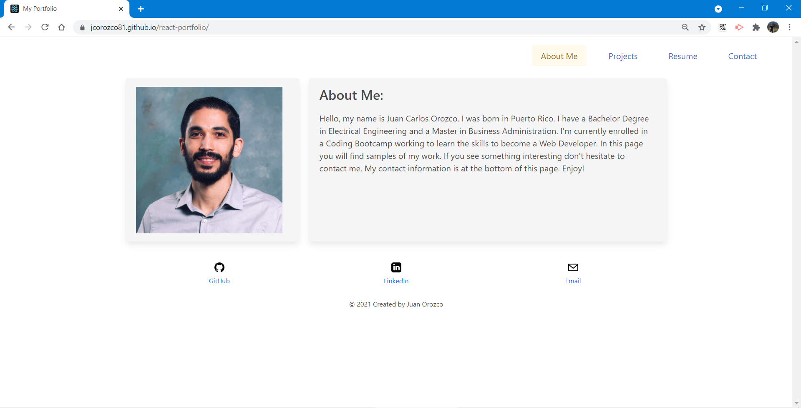

# react-portfolio 
My React Portfolio

  
## Description
***

**My React Portfolio** website was created with the purpose of providing potential employers or clients a way to discover and evaluate my Web Developer skills. The website has four different sections with the following information.

- An About Me section with a brief description of myself.
- The Projects section wich contains the links to deployed projects and their respective repositories.
- The **Resume and Skills** section wich contains the links to deployed projects and their respective repositories.
- A Contact Me section wich contains my email and links to my social media networks profiles.


## Table of Contents
***  

- [Installation](#installation)
- [Usage](#usage)
- [How to Contribute](#How)
- [Tests](#Tests)
- [Questions](#Questions)
- [License](#license)

  
  
## Installation
***

The application is deployed at the following address: [My React Portfolio](https://jcorozco81.github.io/react-portfolio/). Local installation is optional.

To complete the local installation, following these instructions:
    
1. To install a Node JS project, install [Node JS](https://nodejs.org/)       

2. Clone the GitHub repository to you local computer. Click on the following link.
 
  * Repository link : https://github.com/jcorozco81/react-portfolio

3. To install the packages listed in the ```package.json``` file, run ```npm i```.


## Usage
***
   
1. If the application for was installed locally, start the application by running the following command ```npm start```. A web browser window will be automatically opened with the website.

Or

1. The deployed application can be found at the followign address: [My React Portfolio](https://jcorozco81.github.io/react-portfolio/)
  
 

## How to Contribute
***

  Developers who are interested in contributing ideas for this application must agree to follow and comply with the Contributor Covetnant: Code of Conduct. The Contributor Covenant Code of Conduct can be found in the following address:

  [Contributor Covenant Code of Conduct](https://www.contributor-covenant.org/version/2/0/code_of_conduct/code_of_conduct.md/)


## Tests
***
  No test cases were created for this project.


## Questions
***
  
  You can find additional projects on my github page: https://github.com/jcorozco81.

  If you have any questions please contact me at my E-Mail address: jcorozco@gmail.com.


## License
***

Copyright (c) 2021 jcorozco81.


This software/code is licensed under the MIT License; to use this software/code you must agree to follow and comply the License. A copy of the License can be found at:

https://www.mit.edu/~amini/LICENSE.md